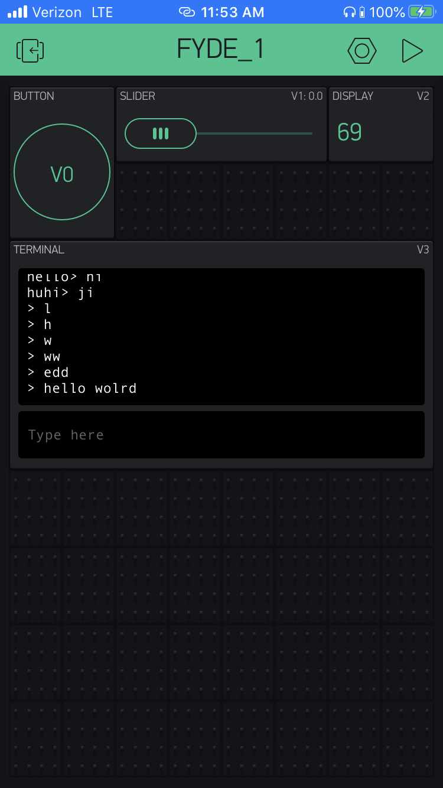

Name: Caroline Li

EID: cjl3656

Team Number: F4

## Questions

1. What is the purpose of an IP address?

    An IP address identifies and locates devices sending and recieving over the internet
or an isolated network such as an ethernet.

2. What is a DNS? What are the benefits of using domain names instead of IP addresses?

    A DNS or Domain Name Service serves as a loopkup table mapping symbolic names to IP addresses,
which are harder to remember and deal with.

3. What is the difference between a static IP and a dynamic IP?

    Static IP addresses do not change and are assigned once by the Internet Service Provider.
Generally, they are used for email or web servers, which need a constant IP address that is 
linked to a domain name. However, static IP addresses are more costly and less secure, so
dynamic IP addresses can be used instead. Dynamic IP addresses are IP addresses assigned
to a certain device that change periodically when accessing the internet. Usually, the dynamic
IP addresss is controlled by the DHCP protocol, which assigns different IP addresses to devices
accessing the internet. Dynamic IP addresses are more secure and also less costly.

4. What is the tradeoff between UDP and TCP protocols?

    The TCP protocol is more reliable and gaurantees connection but slow, while the UDP
protocol is not always reliable but much faster.

5. Why can't we use the delay function with Blynk?

    Delay blocks the program from executing for a certain time. Since Blynk is event based,
it has its own flow of execution when handling events, which will be messed up if delay()
is called.

6. What does it mean for a function to be "Blocking"?

    Blocking means a function stops execution and prevents anything else from being
executed (unless we are doing concurrency or multi-threading). Delay() is an example
because the program stops execution for the amount of time specified.

7. Why are interrupts useful for writing Non-Blocking code?

    Interrupts, like the event handlers used in Blynk, allow the program
to handle specific events promptly without wasting time in a blocking function.
Essentially, while the Arduino code is running, an event will interrupt, or cause a
context switch into an event handler through Blynk. When this event handler is done, 
control is given back to the Arduino code execution.

8. What is the difference between interface and implementation? Why is it important?

   Interface is the contract specified between the user and the actual program. In other words,
an interface describes how the function will be called in a certain program. An implementation,
on the other hand, is how the function executes what the interface implies it should do. Interfaces
are important because they allow us give a specific implmentation and use it with the same 
calling convention described by the interface. Interfaces give us more flexibility on 
what exactly will be done, without worrying about whether different parts of the program
are still compatible, because they all adhere to the same interface.

9. Screenshot of your Blynk App:

    

